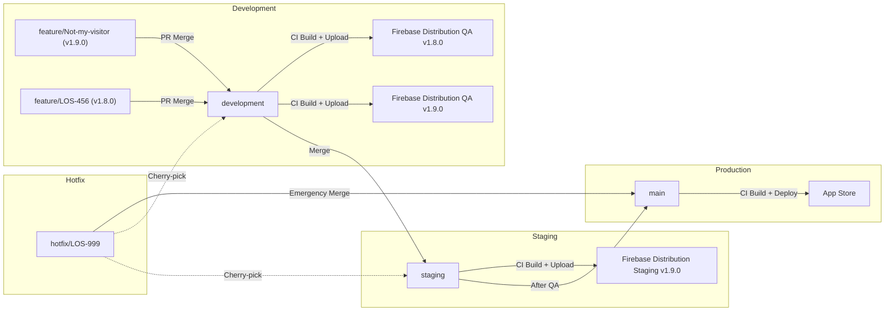
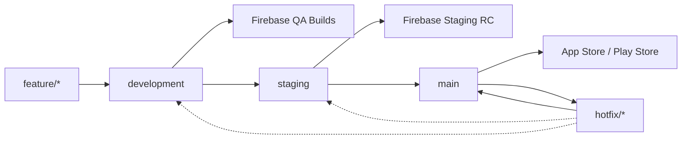

## Branching Strategy (Mobile App)

We use a **3-branch model** (Git Flow) optimized for 2-week sprints

### Environment Flow


---

# 🚀 Branching Strategy (Mobile App)

เราใช้ **3-Branch Model (development → staging → main)**  
ออกแบบมาสำหรับ **Mobile App + 2-Week Sprint + CI/CD อัตโนมัติ**

แนวคิดหลักคือ:

- Dev ทำงานเร็ว
- QA เทสหลาย build ได้
- Release มีแค่ตัวเดียว (ไม่งง)
- Production เสถียรที่สุด

---

## 🧠 Core Concept

| Branch | หน้าที่ | ใครใช้ |
|-------|----------|----------|
| **development** | รวมทุก feature / build ได้หลายเวอร์ชัน | Dev + QA |
| **staging** | Release Candidate เดียวของ Sprint | QA |
| **main** | Production เท่านั้น | Users |

---

## 🧱 Branch Structure

```
feature/*
bugfix/*
hotfix/*
   ↓
development
   ↓
staging   ⭐ Release Candidate
   ↓
main      🚀 Production
```

---

## 🔁 Environment Flow (Overview)



---

# 🔄 Workflow (Step-by-Step)

## 1️⃣ Development Phase (Feature Work)

Dev ทำงานบน:

- feature/*
- bugfix/*

เปิด PR → merge เข้า `development`

### 🤖 CI ทำงานอัตโนมัติ
- Build app
- Upload → Firebase Distribution (QA)

### ✅ คุณสมบัติ
- มีหลาย build พร้อมกัน
- ทดสอบ feature แยกได้
- ไม่ต้องรอ release
- ใช้เป็น playground ได้เต็มที่

👉 **development = sandbox ของทีม**

---

## 2️⃣ QA Testing (Dev Channel)

ทุกครั้งที่ push เข้า `development`

QA สามารถ:
- เทสหลายเวอร์ชันพร้อมกัน
- เทส feature เฉพาะตัว
- หา bug ได้เร็วขึ้น
- ไม่ต้องรอ sprint จบ

👉 **เร็ว + อิสระ + เหมาะกับ Mobile มาก**

---

## 3️⃣ Prepare Release Candidate (สำคัญที่สุด ⭐)

เมื่อ sprint ใกล้จบ:

```
development → staging
```

### 🤖 CI จะ
- build 1 ครั้งเท่านั้น
- upload → Firebase Staging

### ✅ คุณสมบัติ
- มีแค่ 1 เวอร์ชัน
- stable
- ทดสอบขั้นสุดท้าย
- พร้อมปล่อย store ได้ทันที

👉 **staging = single source of truth**

---

## 4️⃣ Production Release

เมื่อ QA อนุมัติแล้ว:

```
staging → main
```

### 🤖 CI จะ
- build production
- deploy → App Store / Play Store

👉 **main = production only (ห้าม push ตรง)**

---

## 5️⃣ Hotfix (กรณีฉุกเฉิน)

```
main → hotfix/*
```

แก้เสร็จ:

```
merge → main
cherry-pick → development
cherry-pick → staging
```

เพื่อป้องกัน code divergence

---

# ⚙️ CI/CD Pipeline Setup

## 🟢 Development Pipeline

Trigger:
```
push → development
```

Steps:
```
build
upload → Firebase QA
```

---

## 🟡 Staging Pipeline

Trigger:
```
push → staging
```

Steps:
```
build release candidate
upload → Firebase Staging
```

---

## 🔴 Production Pipeline

Trigger:
```
push → main
```

Steps:
```
build production
deploy → Store
```

---

# ✅ Benefits

- เข้าใจง่าย
- branch น้อย
- ไม่ต้องใช้ release/*
- QA เทสหลาย build ได้
- staging มีเวอร์ชันเดียว ลดความสับสน
- CI config ง่าย
- เหมาะกับ Mobile App มาก

---

# 🧩 TL;DR

```
development → many builds → QA
staging     → one stable build → release
main        → production only
```
