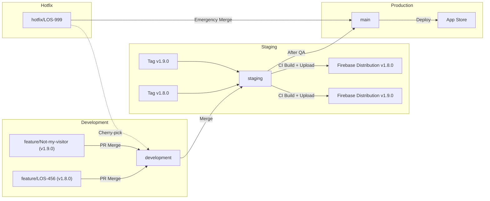

## Branching Strategy (Mobile App)

We use a **3-branch model** (Git Flow) optimized for 2-week sprints

### Environment Flow

```mermaid
flowchart LR

    %% ======================
    %% Development
    %% ======================
    subgraph Development
        F18["feature/LOS-456 (v1.8.0)"] -->|PR Merge| D[development]
        F19["feature/Not-my-visitor (v1.9.0)"] -->|PR Merge| D
    end

    %% ======================
    %% Staging (Single branch, Tag-based)
    %% ======================
    subgraph Staging
        D -->|Merge| S[staging]

        T18["Tag v1.8.0"] --> S
        T19["Tag v1.9.0"] --> S

        S -->|CI Build + Upload| FD18["Firebase Distribution v1.8.0"]
        S -->|CI Build + Upload| FD19["Firebase Distribution v1.9.0"]
    end

    %% ======================
    %% Production
    %% ======================
    subgraph Production
        S -->|After QA| M[main]
        M -->|Deploy| AS["App Store"]
    end

    %% ======================
    %% Hotfix
    %% ======================
    subgraph Hotfix
        H["hotfix/LOS-999"]
        H -->|Emergency Merge| M
        H -.->|Cherry-pick| D
    end
```

---

# Branch + Tag Driven CI/CD (Mobile App)

เนื่องจาก กรณีของ Mobile App ใน 1 Sprint นั้น QA สามารถ เทสแอปได้ มากกว่า 1 release เวอร์ชั่น.

นี่คือ Branch + Tag driven CI/CD สำหรับ Mobile App ที่
มี staging branch เดียว แต่สามารถ build ได้หลายเวอร์ชัน 🔥

แนวทาง **Tag-based Release Flow** สำหรับ Mobile App  
ใช้ **staging branch เดียว** แต่ **build ได้หลายเวอร์ชัน** ผ่าน Git Tag

## 🎯 เป้าหมายของ Flowนี้

มี staging branch เดียว

QA สามารถทดสอบ หลายเวอร์ชันพร้อมกัน

แยกเวอร์ชันด้วย Git Tag (เช่น v1.8.0, v1.9.0)

เมื่อมี Tag ใหม่บน staging
→ CI จะ build + upload Firebase App Distribution อัตโนมัติ

❌ ไม่ต้องสร้าง release/* branch เพิ่ม

## 🧱 Branch Structure
feature/*
bugfix/*
hotfix/*
   ↓
development
   ↓
staging        ← ⭐ สำคัญ
   ↓
main

🔁 Flow การทำงาน (ตามลำดับจริง)
1️⃣ Development Phase

Developer ทำงานบน

feature/*

bugfix/*

เปิด PR → merge เข้า development

development = รวมโค้ดทั้งหมดที่ ยังไม่พร้อมปล่อย

2️⃣ เตรียมส่ง QA

เมื่อพร้อมส่ง QA:

merge development → staging

ตอนนี้ staging คือโค้ดที่ พร้อมให้ QA ทดสอบ

3️⃣ แยกหลายเวอร์ชันด้วย Git Tag (หัวใจของ Flow ❤️)

แทนการสร้างหลาย branch → ใช้ Git Tag

ตัวอย่าง:

git checkout staging
git tag v1.8.0
git push origin v1.8.0

หรือเวอร์ชันถัดไป:

git tag v1.9.0
git push origin v1.9.0

✅ ทั้ง v1.8.0 และ v1.9.0
ชี้ไปที่ staging branch
แต่เป็น คนละ snapshot ของเวลา

4️⃣ CI/CD ทำงานอัตโนมัติ (สำคัญที่สุด)

CI ถูกตั้งค่าให้:

🔔 Trigger เมื่อมี Tag ใหม่ที่ขึ้นต้นด้วย v*

ผลลัพธ์ที่ได้:

CI checkout โค้ดจาก Tag นั้น

Build แอปตาม version / tag

Upload ไปที่ Firebase App Distribution

QA ได้รับแอปทันที

📦 QA สามารถทดสอบ:

App v1.8.0

App v1.9.0

สามารถติดตั้งพร้อมกันได้
(ถ้าตั้ง versionName / buildNumber ถูกต้อง)

5️⃣ QA ผ่าน → ปล่อย Production

เมื่อ QA ยืนยันว่าเวอร์ชันใดผ่าน (เช่น v1.8.0):

merge staging → main

หรือ merge เฉพาะ commit ของ Tag นั้น

CI ฝั่ง main ทำงาน

Deploy ขึ้น App Store / Play Store

6️⃣ Hotfix (กรณีฉุกเฉิน)

สร้าง hotfix/* จาก main

แก้ไขเสร็จ → merge เข้า main

cherry-pick กลับ:

development

staging

ถ้าต้องให้ QA ทดสอบ:

ปัก Tag ใหม่ เช่น v1.8.1

### ⚙️ CI/CD Trigger ที่ต้องตั้งค่า (สำคัญมาก)
แนวคิดหลัก

CI ไม่จับ branch staging
แต่ จับ Git Tag

ตัวอย่าง Concept (ไม่ผูกกับเครื่องมือใด)

Trigger:

on: push

tags: v*

Condition:

Tag ต้องชี้มาที่ staging

## 🧠 ทำไม Flow นี้ถึง “ดีมาก”
✅ ข้อดี

มี staging branch เดียว → โครงสร้างเรียบง่าย

QA ทดสอบหลายเวอร์ชันพร้อมกันได้

ไม่ต้องสร้าง release/* branch จำนวนมาก

Tag = Version = Artifact (trace ง่าย)

Rebuild เวอร์ชันเก่าได้ทันที (reproducible)

⚠️ ข้อควรระวัง

อย่าแก้โค้ดบน staging หลังจากปัก Tag แล้ว

ถ้าจำเป็นต้องแก้:

merge ใหม่

ปัก Tag ใหม่

versionName / buildNumber ต้องสัมพันธ์กับ Tag เสมอ

🧩 สรุปในประโยคเดียว

คุณใช้ “staging branch เดียว + Tag-driven CI/CD”
เพื่อสร้างหลาย QA build บน Firebase Distribution
และนี่คือ Best Practice สำหรับ Mobile App จริง ๆ