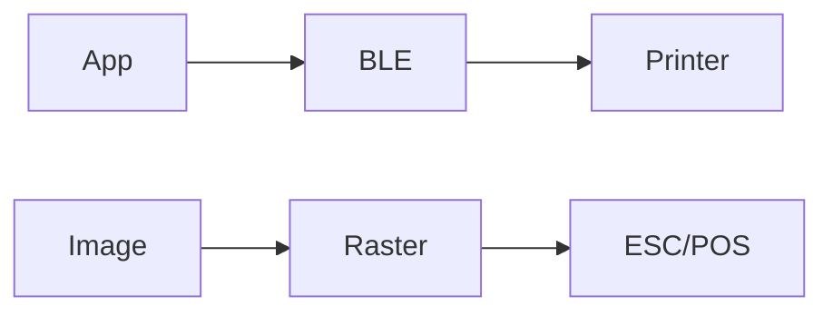

# 🚀 Shape Up Playbook

> Lightweight product delivery process  
> Based on Basecamp Shape Up model  
> Optimized for small engineering teams

---

# 📚 Overview

## Cycle Structure
- 6 weeks build
- 2 weeks cooldown

## Flow
Shaping → Betting → Building → Hill Chart → Cooldown

## Rules
- No backlog hoarding
- Fixed time, flexible scope
- Ship real features only
- Cut scope, never extend time

---

# 🧩 1. Shaping

Define problem + rough solution BEFORE coding.

---

## ✨ Shaping Template

### Feature
Printer V2 (example)

### Problem
Users cannot print images reliably via BLE.

### Appetite
4 weeks max  
❌ Cannot exceed

### Solution (high level only)
- Use react-native-thermal-receipt-printer-image-qr
- Convert image → raster → ESC/POS
- BLE queue + retry

### Out of scope
- Cloud printing
- USB
- Fancy UI

### Technical Approach
- BLE scan filter by service UUID
- Chunk write 512 bytes
- Timeout 5s

### Sketch

### Risks
- BLE fragmentation
- iOS permission

### Success Criteria
- Print < 3s
- Success rate > 95%
- Android + iOS

---

# 🎰 2. Betting

Choose only the most impactful work.

## Betting Table

| Feature | Appetite | Impact | Bet? | Notes |
|--------|----------|---------|-------|--------|
| Printer V2 | 4w | High | ✅ | Core |
| AWS IoT | 6w | High | ✅ | Realtime |
| UI Refactor | 2w | Low | ❌ | Skip |

## Rules
- Max 2–3 bets only
- No backlog
- Not selected = drop

---

# 🏗 3. Building

During cycle:

## Team autonomy
- No micromanagement
- No daily standup required
- Dev decides solution

## Constraints
- Time fixed
- Scope flexible

If late → CUT scope

---

# ⛰ 4. Hill Chart (Progress Tracking)

## Meaning
⬆️ Uphill = figuring out  
⬇️ Downhill = implementation

Never use % progress.

---

## Current Status

| Feature | Position | Note |
|----------|------------|-----------|
| Printer V2 | ⬇️ | solved protocol |
| AWS IoT | ⬆️ | auth issues |

---

# 🗓 5. Cycle Plan

## Cycle 01
Duration: Jan 1 → Feb 15

### Committed
- Printer V2
- AWS IoT realtime

### Team
- Dev A
- Dev B

### Goal
Ship both to production

---

# ❄️ 6. Cooldown (Retro)

After each cycle.

## What shipped
- Printer V2
- AWS IoT basic

## What didn’t
- image compression

## Lessons
- BLE chunk too large initially
- iOS permission delayed

## Improvements
- add printer mock
- automated tests

---

# 🔁 Workflow

1. Write shaping section
2. Review in PR
3. Fill betting table
4. Start cycle
5. Update hill chart every few days
6. Cooldown retro
7. Repeat

---

# 🎯 Principles

- Shape first, code later
- Less features, more finished work
- Developers own decisions
- Shipping > perfect planning

---

# 🧠 Tips (for React Native teams)

Works great for:
- big modules (Bluetooth / IoT / Video / Payments)
- refactors
- infra upgrades
- native bridges

Avoid for:
- tiny bug tickets
- maintenance tasks

Use Kanban instead for those.

---

# ✅ Done

If this doc grows too big:
→ split later

But default = keep single file
